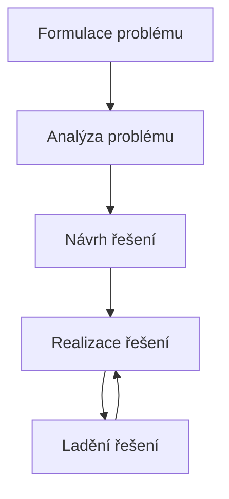

# Algoritmizace
Postup, kterým vytváříme [[Algoritmus|algoritmus]] pro řešení daného problému ($Algoritmizace \rightarrow Algoritmus$).

>**TL,DR:**
>- Výsledkem algoritmizace je algoritmus
>- Kroky algoritmizace 
>   - Formulace a analýza problému
>   - Návrh, realizace a ladění řešení 

## Postup algoritmizace
Algoritmizace se běžně dějě v **pěti krocích**

### Formulace problému
Ze zadání se vytvoří konkrétní požadavky, určí se vstupy a výstupy, s čím vším bude program pracovat či komunikovat, ...

### Analýza problému
Popřemýšlíme nad tím, jakými způsoby bychom mohli náš problém vyřešit

### Návrh řešení
Vybere si nějaké řešení a rozvrhneme si, jak ho uděláme ve vybraném programovacím jazyce pomocí dostupných nástrojů

### Realizace řešení
Začneme zapisovat algoritmus, např. pomocí programovacího jazyka.

### Ladění řešení
Algoritmus otestujeme, zda funguje pro vícero vstupů a jestli nenastanou nějaké případy, ve kterých by selhal či se nechoval podle našich představ

