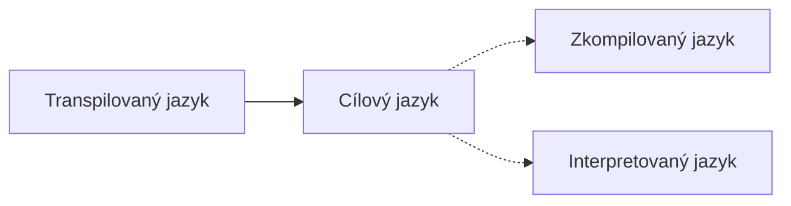

# Transpilovaný jazyk
Transpilování je speciální připad [[Kompilovaný jazyk|kompilace]], kdy se zdrojový kód překladá do zdrojového kódu dalšího jazyka.

> Příkladem může být Typescript, který je nadstavbou Javascriptu.
>- Validní Javascript kód je validní Typescript kód
>- Validní Typescript kód ale není validní Javascript kód

Transpilované jazyky tedy většinou slouží jako tzv. *syntax sugar*, který zjednodušuje, rozšiřuje či spřesňuje syntaxi jazyka.

V případě transpilovaných jazyků se o kompilaci, respektive transpilaci, stará **transpilátor**.

