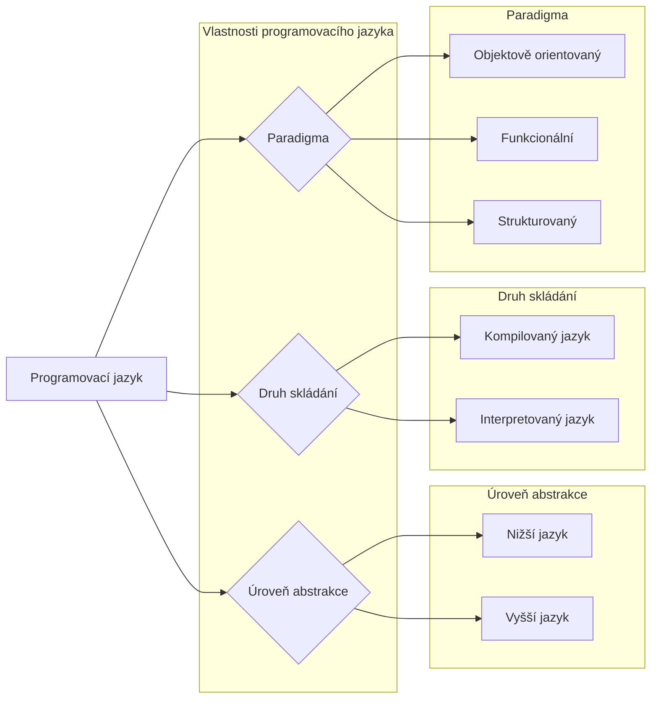

# Úvod do terminologie

## Pojmy

| Syntax | Pravidla pro správný zápis instrukcí |


## Algoritmizace
Algoritmizace je postup, pomocí kterého vytváříme řešení pro daný problém - vytváříme algoritmus.

$$Algoritmizace \rightarrow Algoritmus$$

Proces algoritmizace by se dal shrnout pěti bodů:
1) Formulace problému
2) Analýza problému
3) Návrh řešení
4) Vytvoření řešení
5) Kontrola řešení

Výsledkem těchto pěti kroků bude **algoritmus** - popis postupu k řešení analyzovaného problému. 

Jak ale takový algoritmus vypadá? No záleží, jak ho chceme prezentovat. Algoritmus totiž může být zapsán:
- Slovy
- Graficky pomocí vývojových diagramů
- Matematickým zápisem
- Pomocí rozhodovací tabulky
- Pomocí programovacího či pseudo jazyka
- ...

Každý algoritmus by měl ale bez ohledu na formu zápisu splňovat **pět podmínek**, které z něho algoritmus dělají:

| Vlastnost | Vysvětlení |
| :---: | :---: |
| Konečnost | Algoritmus má konečný počet kroků|
| Elementárnost | Algoritmus je složen ze základních instrukcí |
| Obecnost | Umí řešit problém pro různé vstupy|
| Rezultativnost | Vždy vede k nějakému výsledku |
| Determinovanost | Stejné vstupy nám vždy vrátí stejný výsledek|
| Úspornost | Používá se co nejméně možných prostředků |

Některé to bude chtít trochu dovysvětlit:
- **Determinovanost** je vlastnost, která nám říká, že když dvakrát zadám stejný vstup, tak mi program vrátí dvakrát to stejné číslo. 
	- Algoritmus by tedy neměl pracovat s proměnnými, které jsou deklarovány mimo a ví o nich akorát programátor.
	- Není tam žádná vnější náhoda
- **Úspornost** je taková vlastnost na půl, protože to není nutné, ale rozhodně bychom měli mířit k nejlepší efektivitě.

## Program
Pokud chceme náš algoritmus někde nechat pracovat, musíme mu proto vytvořit adekvátní prostředí. K tomu slouží **programovací jazyky**, které slouží k tvorbě **programů**.

## Vlastnosti programovacího jazyka


Java je **objektově orientovaný**, **interpretovaný** a **vyšší jazyk**.

### Paradigma
Paradigma je způsob, jakým zapsat řešení úlohy. Každé paradigma má své výhody a nevýhody, a jazyky se nutně nemusí vázat jenom na jeden.

Např. *Java* je čistě objektově orientovaný jazyk, zatímco *Javascript* je multiparadigmatický - dovoluje nám použít více <sup>(multi)</sup> paradigmat.

#### Imperativní
Imperativní, někdy též známo jako **procedurální** programovaní popisuje postup pomocí posloupností příkazů, která tvoří algoritmus k řešení úlohy.

Program používá sadu proměnných, na kterých provádí výpočty a podle jejíchž hodnot rozhoduje o dalším běhu programu. Také se hojně využívá **procedur** - bloků kódu, které můžeme zavolat jako celek.

> Často se zaměnují pojmy **procedura, funkce a metoda**. Jaký je mezi nimi rozdíl?
> 
>|Pojem|Čeho je součástí|Vrací hodnotu?|
>|:--:|:--:|:---:|
>|Procedura|Programu|<b style="color:red">Ne</b>|
>|Funkce|Programu|<b style="color:lime">Ano</b>|
>|Metoda|Objektu|<b style="color:gold">Nezáleží</b>|

#### Deklarativní
Imperativní programování popisovalo postup, pomocí kterého dosáhnout jistého výsledku. Deklarativní programování na to jde z opačného směru.

Neříká postup dosažení cíle, ale co je cílem. Říká, **co se má udělat** a né **jak se to má udělat**. Dosažení výsledku nechá na programovacím jazyku.

#### Objektově orientované
Objektově ori
#### Funkcionální


### Úroveň abstrakce
- **NIžší jazyk** - Blíže k mikroprocesoru a JAS[^1]
	- Assembler, C, C++, Rust
- **Vyšší jazyk** - Blíže k lidskému jazyku.
	- Python, Ruby, Java, C#

### Podle druhu překladu
- **Kompilovaný jazyk** - Před během programu se projde celý program, zkontroluje se a kompletně se přeloží do strojového kódu
- **Interpretovaný jazyk** - Instrukce programu se překládají postupně za běhu. Vyžaduje interpret.

### Třídy
- Jazyk Java je objektový => základem jsou **třídy**
- Pro funkční program je tedy potřeba **alespoň jedna** třída
- Třídy se ukládají do stejnojmenných souborů na disku
- Třídy jsou členěny do **balíků**
- Třídy z jiného balíku je třeba importovat *(kdo by to kurva řekl)*
- Struktura balíků musí odpovídat struktuře adresářů

Každý program v Javě má **vstupní bod** - jedná se o "začátek" programu.

```java
public static void main (String[] args) {
	...
}
```

Vstupních bodů (metoda `main`) může být v programu klidně víc. To, která se spustí, záleží na tom, kterou zadáne při spouštění programu. `java TestClass` spustí main metodu ve třídě `TestClass` .

Další třídy se deklarují následujícím způsobem:
```java
package alg1.jk.primitiva;
import java.util.scanner;

public class jmenoTridy {
	...
}
```

[^1]: Jazyk symbolických adres (běžně známo jako Assembler)