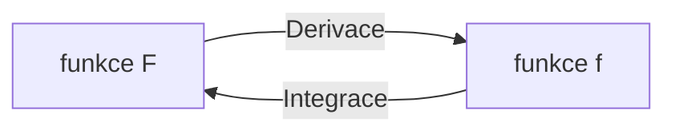

# Integrály
Proces integrace je opačný proces k [[Úvod do derivací|derivaci]].

## Primitivní funkce
Primitivní funkce je taková funkce $F$, pro kterou platí, že
>$$\Large F'(x) = f(x)$$

Co to znamená? Znamená to, že hledáme takovou funkci, která nám po zderivování vyplivne tu, kterou hledáme.

>$$\Large \int{\textcolor{lime}{f(x)}\textcolor{red}{dx}} = \textcolor{yellow}{F(x)} + \textcolor{aqua}{C}$$
>- Funkce $f$ je **integrand**
>- $dx$ je proměnná, podle které integrujeme
>- Funkce $F$ je **primitivní funkcí**
>- $C$ je konstanta, o kterou se primitivní funkce liší[^1]

[^1]:Písmenu $C$ se říká **integrační konstanta**. Vzhledem k tomu, že derivace konstanty je 0, tak můžeme k primitivní funkci přičíst jakékoliv číslo, protože ovlivní akorát pozici na grafu, což nás při derivaci nezajímá.