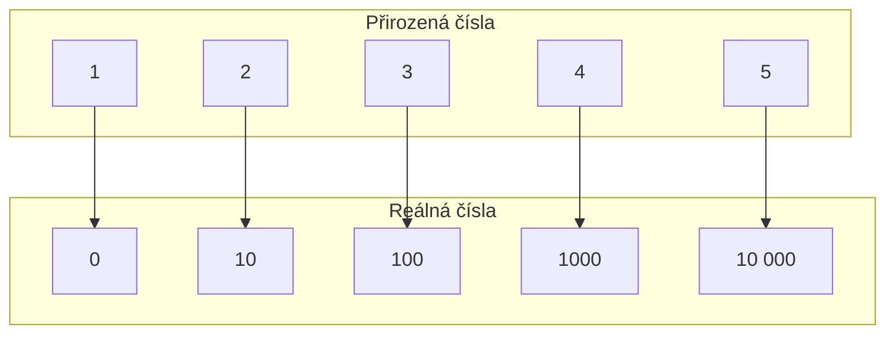

# Posloupnosti
Posloupnost je řada reálných čísel, které jsou přiřazena přirozená čísla. Přirozená čísla se chovají jako **indexy**, tedy říkají pořadí prvku v posloupnosti.

> **TL,DR**:
> - Posloupnost je [[Zobrazení|zobrazení]] [[Číselné množiny#Přirozená čísla|přirozených čísel]] do [[Číselné množiny#Reálná čísla|reálných čísel]]
> -  

Trochu formálnější definicí posloupnosti je to, že posloupnost je [[Zobrazení|zobrazením]] z přirozených čísel do reálných čísel. Smysl to dává - koukněme na tenhle obrázek:

Každému číslu z reálných čísel jsme přiřadili jedno přirozené, které se chová jako jeho pořadové číslo (index).

## Značení
Posloupnosti se stručně zapisují jako:
> $$\LARGE\{a_n\}_{n=1}^{\infty}$$
> - Posloupnost, která začíná od jedničky a jde až do nekonečna
> $a_n$ je prvek, který je na pozici s číslem $n$.
>   - Pokud je $n=1$ -> první prvek
>   - Pokud je $n=2$ -> druhý prvek
>   - Pokud je $n=3$ -> třetí prvek
>   - ...

## Související
[[Monotónnost posloupnosti]]
[[Prostost posloupnosti]]
[[Vlastní limita posloupnosti]]