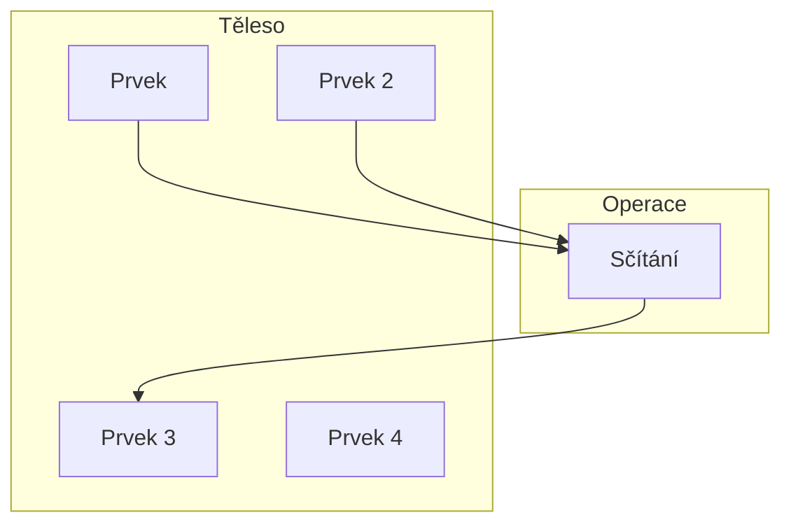

# Algebraické těleso

Algebraické těselo $T$ je 
- **libovolná množina**
- a dvě binární operace

Množina může být skutečně libovolná. Jedinou podmínkou je, že nesmí být prázdná ($T\not= \emptyset$).

Prvkům tělesa (množiny) se říkají, nečekaně, **prvky tělesa**.

## Binární operace
**Binární operací** se myslí proces, který ze dvou vstupů udělá jeden výstup. 
- Výsledek operace je stejného typu jako vstupy
- Výsledek je stále součástí naší libovolné množiny 

Dvě operace v algebraickém tělese jsou:
- (Vektorové) **sčítání**
- (Vektorové) **násobení**
- Tyto operace se dají v případě potřeby **redefinovat**
	- Vektorem může být číslo, rovnice, funkce, matice, ...
	- Operace s těmito objekty né vždy fungují jako sčítání a násobení čísel.
	- Pro oddělení s číselným sčítáním a násobením se jim říká **vektorový** součet a **vektorový** součin

Je tedy potřeba tyto operace zobecnit natolik, že je budeme moci použít "na všechny prvky tělesa".

Když mluvíme o těchto binárních operacích, říkáme, že provádíme operace **nad tělesem** (Např. operace nad tělesem $T$).
- Říká nám to, v jakém tělese operace probíhají
- a s jakým typem matematického objektu pracují

## Axiómy tělesa

> **Axiom** (z [řec.](https://cs.wikipedia.org/wiki/%C5%98e%C4%8Dtina "Řečtina") _axióma_, to co se uznává) je tvrzení, které se předem pokládá za platné, a tudíž se nedokazuje. Podobný význam má slovo [postulát](https://cs.wikipedia.org/wiki/Postul%C3%A1t "Postulát").

Ačkoliv si můžeme podle potřeby redefinovat sčítání a násobení, je potřeba zajistit, aby platila určitá pravidla - **axiómy tělesa**

Tyto pravidla totiž zajištují, že operace budou definované pro všechny prvky tělesa[^1] a že se budou chovat podobně, jako sčítání a násobení čísel.

Těchto pravidel existuje celkem deset:[^2]

1. **Komutativnost sčítání a násobení** - Pro libovolné prvky $a, b$ z tělesa $T$ musí platit, že:
	1. $a+b = b+a$ 
	2. $a\times b = b \times a$
2. **Asociativita sčítání a násobení** - Pro libovolné prvky $a, b$ z tělesa $T$ musí platit, že:
	1. $a+(b+c) = (a+b)+c$
	2. $a\times (b\times c) =(a\times b) \times c$
3. **Existuje nulový prvek** - V tělese existuje prvek, který si označíme jako $0$ , pro který platí, že:
	1. $a+0=a$
4. **Existuje opačný prvek** - Pro libovolný prvek $a$ musí existovat opačný prvek $-a$, pro které platí, že:
	1. $a + (-a) = 0$
5. **Existuje jednotkový prvek** - Existuje prvek, který si označíme jako $1$, pro který platí, že:
	1. $a\times 1=1$
6. **Existuje inverzní prvek** - Existuje prvek, který si označíme jako $a^{-1}$, pro který platí, že:
	1. $a\times a^{-1} = 1$
7. **Distributivnost** - Pro libovolné tři prvky $a, b, c$ musí platit, že:
	1. $a\times(b+c)=(a\times b)+(a\times c)$
8. **Netrivialita** - Nulový prvek a jednotkový prvek **nesmí** být stejné
	1. $0\not=1$

Kam se ale podělo odčítání a dělení?
- Odečítání se dělá přičítáním opačného prvku
	- $5 - 2 = 5 + (-2)$
- Dělení se dělá násobením inverzního prvku
	- $10/5 = 10\times5^{-1}$

[^1]: To znamená, že půjdou provést pro všechna čísla v naší libovolné množině.
[^2]: Některé axiómy budou spojené dohromady, pokud platí jak pro násobení, tak i sčítání - např. **komutativnost sčítání** a **komutativnost násobení** jsou spojeny pod **komutativnost sčítání a násobení** .