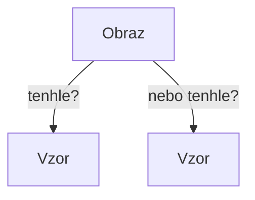
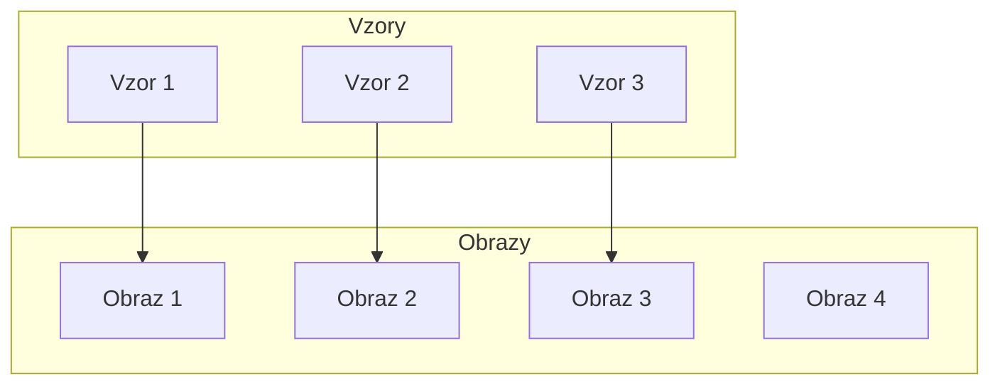
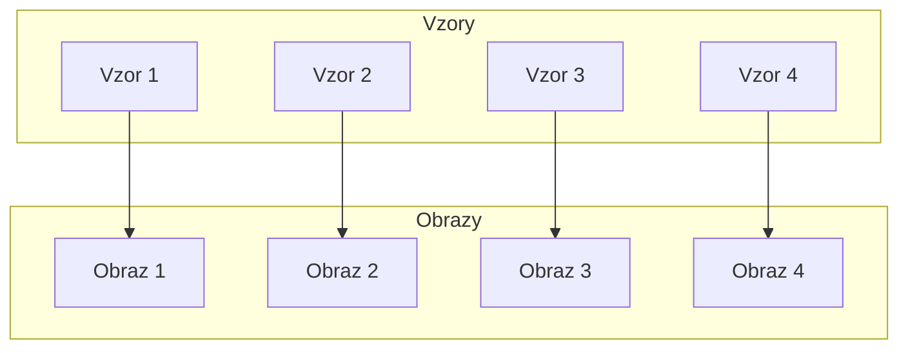

# Zobrazení
> **Zobrazení** (v angličtině *map* či *mapping*) je v [matematice](https://cs.wikipedia.org/wiki/Matematika "Matematika") předpis, kterým se prvkům určité [množiny](https://cs.wikipedia.org/wiki/Mno%C5%BEina "Množina") _X_ přiřazuje **nejvýše jeden** prvek množiny _Y_. Přesněji mluvíme o _zobrazení z množiny X do množiny Y_.
![[Pasted image 20211011203657.png]]

Zobrazení nám tedy říká, jakým způsobem máme přiřadit věci z jedné skupiny k věcem z druhé skupiny (viz obrázek).

Můžeme říct, že zobrazení vytváří vztah **(relaci)** mezi dvěma skupinami věcí (*binární* relace - vztah *dvou* věcí).

Důležitou vlastností je, že můžeme přiřadit **nejvýše jeden** prvek. Nemůžeme se nám tedy stát, že by prvek z první skupiny "ukazoval" na více prvků ze skupiny druhé. Jak bychom pak věděli, na který máme koukat???

## Pojmy
| Pojem | Význam  |
| :-------: | :------ |
| Množina | Soubor prvků se stejnou vlastností |
| Podmnožina | Specifičtější výběr z množiny |
| Výchozí množina | Množina, jejíž prvky přiřazujeme|
| Cílová množina | Množina, k jejíž prvkům přiřazujeme|
| Vzor | Prvek z výchozí množiny |
| Obraz | Prvek cílové množiny |
| Definiční obor | Množina vzorů (Výchozí množina)|
| Obor hodnot | Množina obrazů (Cílová množina)|

## Druhy zobrazení
Podle toho, jakým způsobem jsou prvky výchozí množiny zobrazeny do cílové množiny se zobrazení dělí na:

---
Zobrazení **na množině**
- *Výchozí a cílová množina jsou totožné*
---
Zobrazení **množiny do množiny** 
- *Ke každému vzoru existuje právě jeden obraz. *
---
Zobrazení **množiny na množinu**
- *Každý obraz má svůj vzor*
- *Tzn. zobrazuje se na celou cílovou množinu*
---
Zobrazení množin se také dá dělit podle jejich vlastností na:

---
**Prosté zobrazení** (injektivní zobrazení)
- Každý vzor má jiný obraz
- Mohou existovat *obrazy* bez *vzoru*

> $$f: A \rightarrow B$$
>$$
\forall[x_1,y_1],[x_2,y_2]
\in
f: x_1 \not= x_2 \implies y_1 \not= y_2
>$$
>"Pro každou uspořádanou dvojici platí, že obrazy nejsou stejné, ani vzory nejsou stejné." *(asi, pozn. red)*

---
**Vzájemně jednoznačné zobrazení** (bijektivní zobrazení)
- Každý vzor má svůj obraz
- Žádný prvek nezůstává nepřiřazený

> $$f: A\leftrightarrow B$$

---
**Inverzní zobrazení**
- Zobrazuje "opačným směrem" než původní zobrazení
	- Obrazům přiřazuje vzory
- Zobrazení musí být *prosté* zobrazení *na*

> $$ f(a) = b\leftrightarrow f^{-1}(b) = a  $$