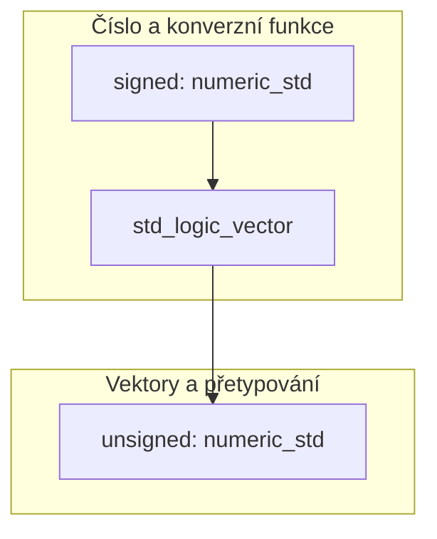

```mermaid
flowchart TD
subgraph ide1 [Číslo a konverzní funkce]
	S[signed: numeric_std] --> V[std_logic_vector]
	
end

subgraph ide2 [Vektory a přetypování]
	V --> S2[unsigned: numeric_std]
end
```