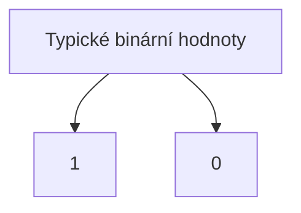

# Binární hodnoty
Jedná se o logické hodnoty, které používáme pro kódování napěťových úrovní.

Podle toho, jakou technologii používáme, se mohou napěťové úrovně lišit.

## Negativní logika
Negativní logika obrací obrací význam binárních hodnot, tudíž logická jednička reprezentuje nepravdu.

Tato logika se používá díky své větší odolnosti proti šumu a lehce větší rychlosti v TTL logice.[^1]

[^1]: Bez zacházení do nějakého hlubšího detailu, odolnost je získána díky vlastnostem tranzistorů. Taky se používala díky tomu, že TTL technologie rychleji přepíná z jedničky na nulu, než-li naopak.